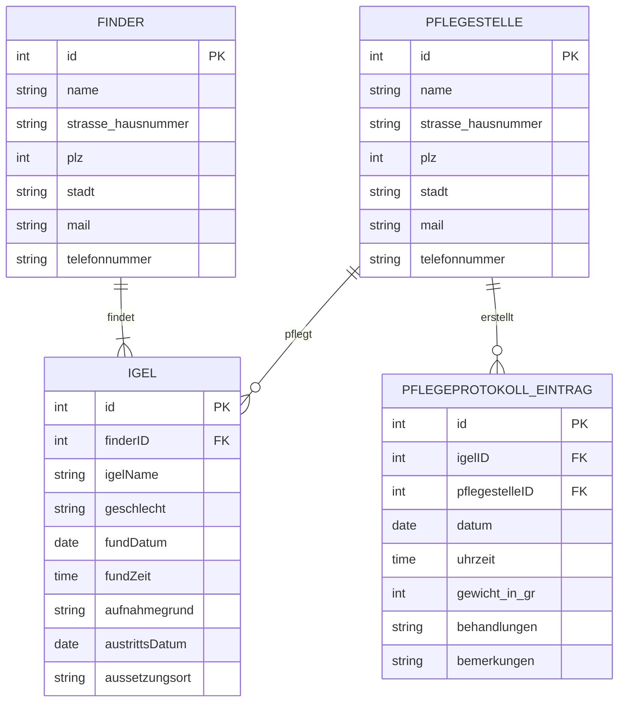
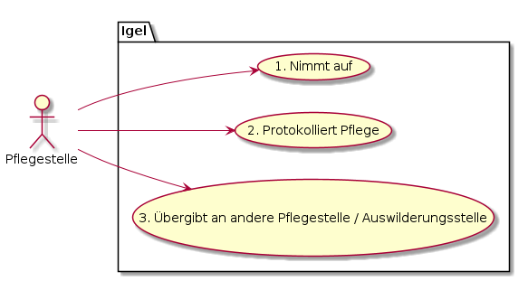

# igelhilfe_pflegeprotokoll

## Entity Relationship Model

```mermaid
erDiagram
    FINDER ||--|{ IGEL : findet
    FINDER {
        int id PK
        string name
        string strasse_hausnummer
        int plz
        string stadt
        string mail
        string telefonnummer
    }
    PFLEGESTELLE ||--o{ IGEL : pflegt
    PFLEGESTELLE ||--o{ PFLEGEPROTOKOLL_EINTRAG : erstellt
    PFLEGESTELLE {
        int id PK
        string name
        string strasse_hausnummer
        int plz
        string stadt
        string mail
        string telefonnummer
    }
    IGEL {
        int id PK
        int finderID FK
        string igelName
        string geschlecht
        date fundDatum
        time fundZeit
        string aufnahmegrund
        date austrittsDatum
        string aussetzungsort 
    }
    PFLEGEPROTOKOLL_EINTRAG{
        int id PK
        int igelID FK
        int pflegestelleID FK
        date datum
        time uhrzeit
        int gewicht_in_gr
        string behandlungen
        string bemerkungen
    }
```

### Use-Cases

